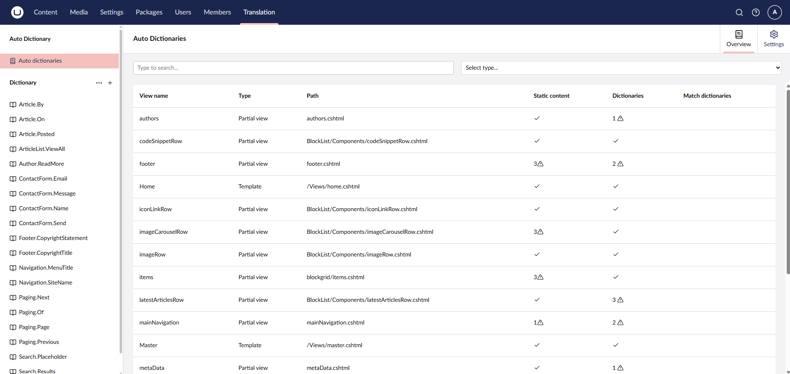
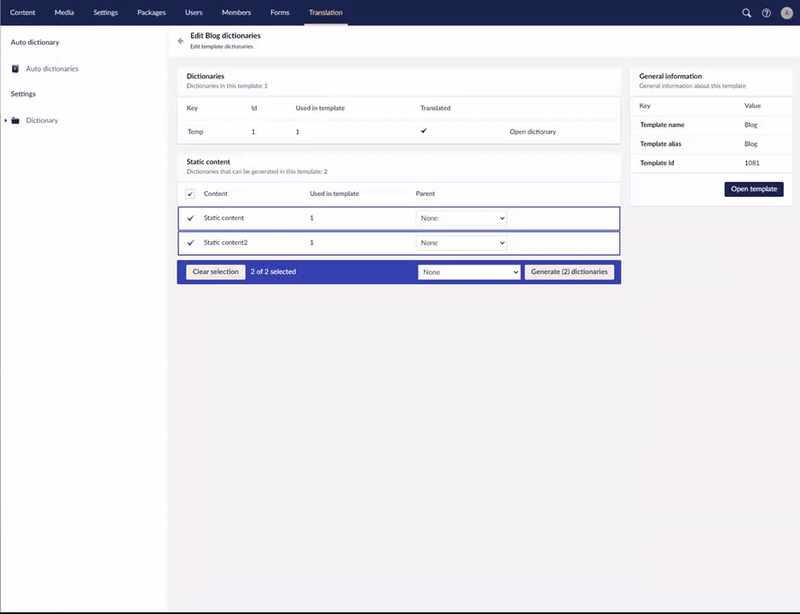
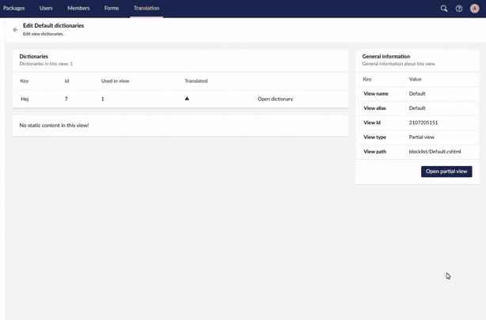
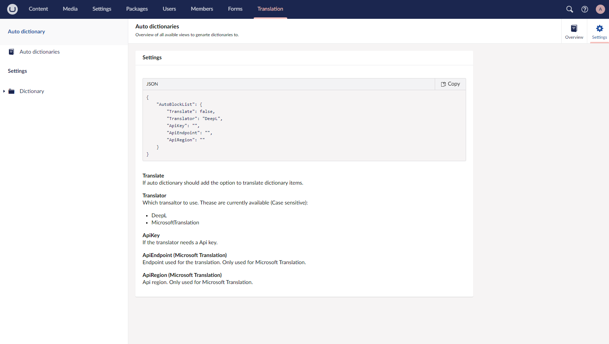
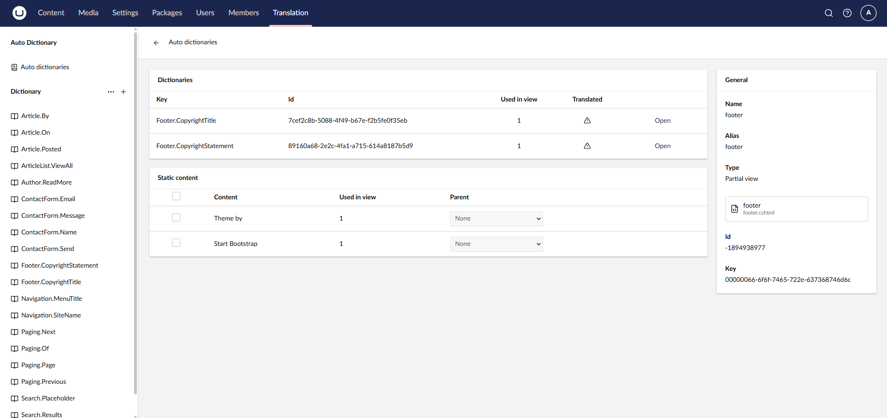
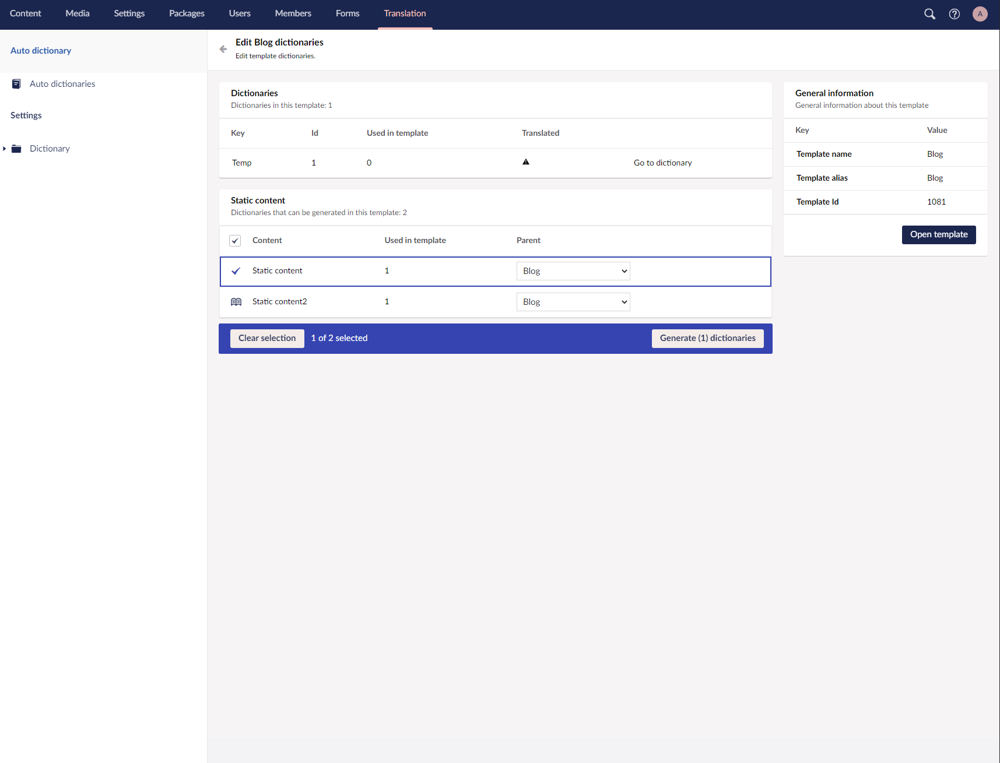

# Auto Dictionaries

Auto Dictionaries is an Umbraco package made to automate the process of replacing static content in templates and partial views with dictionary items. With built-in translation support, it streamlines the localization workflow for multilingual Umbraco websites.

## What is Auto Dictionaries

Auto Dictionaries is a backoffice extension for **Umbraco** that automates the localization process. It scans templates and partial views for static content, matches it with existing dictionary items, or creates new ones with automatic translation support.

## ✨ Features

- 🔍 **Automatic Static Content Detection** - Uses regex to identify translatable content between HTML tags
- 🌐 **Accessibility Support** - Detects static content in HTML attributes that are important for accessibility and user experience
- 🔄 **Dictionary Item Matching** - Matches static content with existing dictionary items
- ✨ **One-Click Dictionary Generation** - Create and insert dictionary items directly into your views
- 🌍 **Multi-Language Translation** - Automatically translate content into all configured Umbraco languages
- 📝 **Template & Partial View Support** - Works with both Umbraco templates and partial views
- 👁️ **Preview** - See changes before applying them
- 🔧 **Flexible Translation Services** - Support for DeepL and Microsoft Translator

After installation, the package will automatically register its services and appear in the Umbraco backoffice under the **Translation** section.

> Note: Automatic translation is disabled by default. Auto Dictionaries will create dictionary items without calling any translation service unless you enable translation and provide API credentials in your `appsettings.json`.

### Accessibility Support
Auto Dictionaries also detects static content in HTML attributes that are important for accessibility and user experience, including:
- `placeholder` attributes (form input hints)
- `alt` attributes (image descriptions)
- `aria-label` attributes (screen reader labels)
- `title` attributes (tooltip text)

## How It Works

1. **Content Scanning**: Auto Dictionaries scans your views and uses regular expressions to identify static content.
2. **Dictionary Matching**: Checks if the content matches any existing dictionary item values across all languages
3. **User Action**: You can:
   - Match to existing dictionary items
   - Create new dictionary items (with or without translation)
   - Preview changes before applying
4. **View Update**: The static content is replaced with `@Umbraco.GetDictionaryValue("key")` syntax
5. **Translation** (optional): If enabled, newly created dictionary items are automatically translated to all configured languages

## ⚙️ Configuration

The package is configurable in `appsettings.json`:

### Configuration Options

| Setting | Type | Default | Description |
|---------|------|---------|-------------|
| `Translate` | boolean | `false` | Enable/disable automatic translation feature |
| `Translator` | string | `"DeepL"` | Translation service to use (`DeepL` or `MicrosoftTranslation`) |
| `ApiKey` | string | `""` | API key for the selected translation service |
| `ApiEndpoint` | string | `""` | API endpoint (Microsoft Translator only) |
| `ApiRegion` | string | `""` | API region (Microsoft Translator only) |

## 🌐 Translation Services

### DeepL (Default)

1. [Create a free DeepL API account](https://www.deepl.com/en/pro/change-plan?cta=apiDocsHeader#developer)
2. Get your API key
3. Configure in `appsettings.json`:

### Microsoft Translator

1. Create an Azure account
2. [Create a Translator resource](https://learn.microsoft.com/en-us/azure/ai-services/Translator/create-translator-resource)
3. Get your subscription key, endpoint, and region
4. Configure `appsettings.json`

## ⚠️ Known Issues

Sometimes Auto Dictionaries may detect false positives when scanning for static content. If you encounter incorrect detection:

1. Please [create an issue](https://github.com/Lantzify/auto-dictionaries/issues) with:
   - The HTML structure causing the false positive
   - Expected vs. actual behavior
   - Screenshot (if applicable)

This helps improve the package for everyone!

## 🙏 Support

If you find this package helpful, please:
- ⭐ Star the repository
- 📢 Share it with others
- 🐛 Report bugs and suggest features
- 💝 Consider contributing

## 📸 Screenshots

### Overview Dashboard

### Generating Dictionaries

### Translating Existing Dictionary Items

### Settings Panel

### Edit View

### Dictionary Selection
