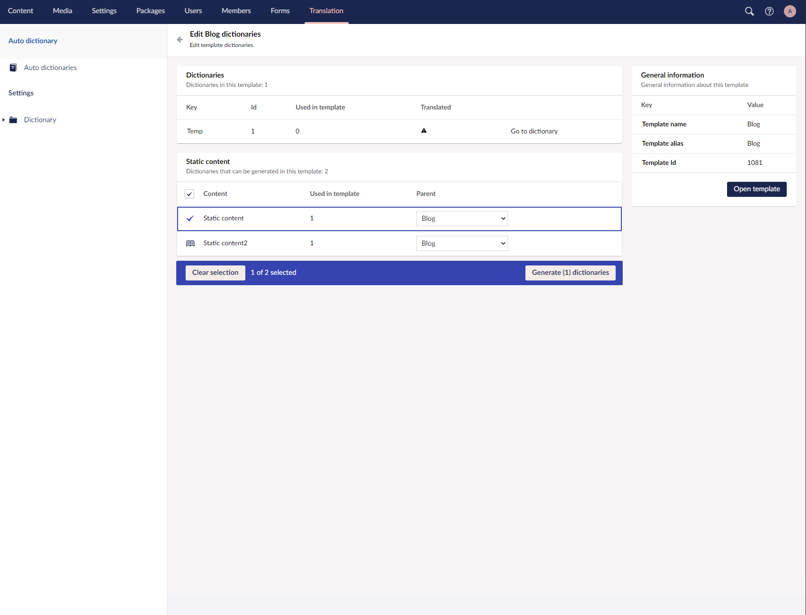

# Auto dictionaries

Auto dictionaries is a Umbraco package that finds static content in templates and replaces them with dictionary items.


[](https://www.nuget.org/packages/AutoDictionaries/)
[](https://our.umbraco.com/packages/backoffice-extensions/auto-dictionaries/)


## About

Auto dictionaries is a Umbraco package made for v8+. Made to help automate the process of replacing static content in templates with dictionary items. It can be found on the under the "Translation" section and is an admin only tool. Not visible for user group "editors".


## Installation

You can install Auto dictionaries via Nuget Or via Umbraco backoffice!

```
PM> Install-Package AutoDictionaries
```
## Contributing

If you would like to help me improve this package, feel free to create a pull request!

## Issues

If you find any issues with the package feel free to raise a issue!

## Screenshots



